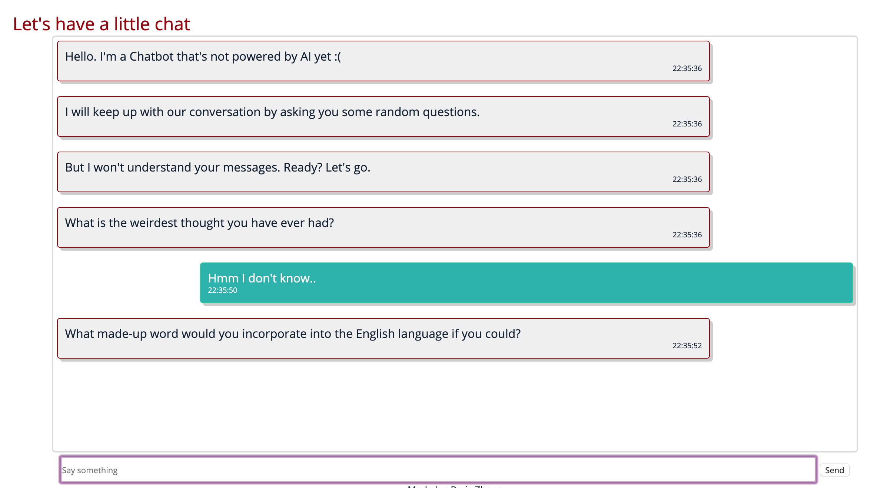

## Simple Chatbot
A simple chatbot that's not powered by AI. 

On one side the computer will generate a random conversation, on the other side the user can post messages. The screen automatically flows and follows the messages posted and the messages are displayed in color bubbles. 

Built with HTML, CSS, JavaScript and jQuery.

